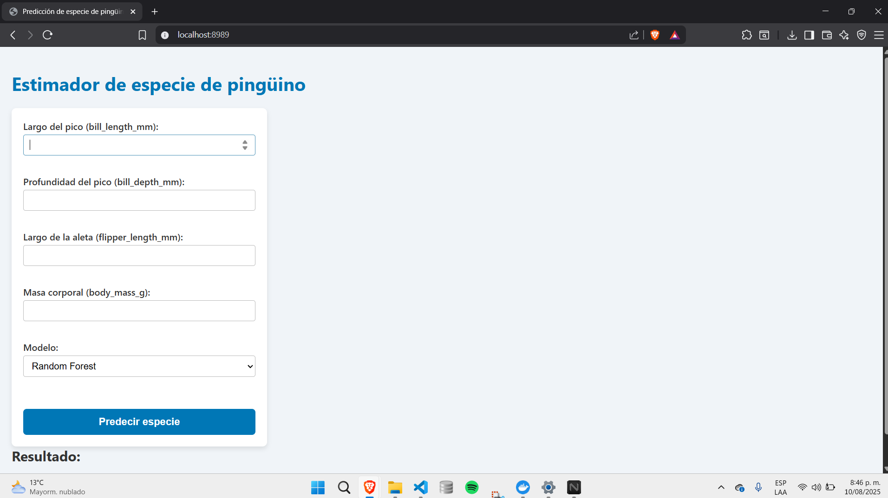
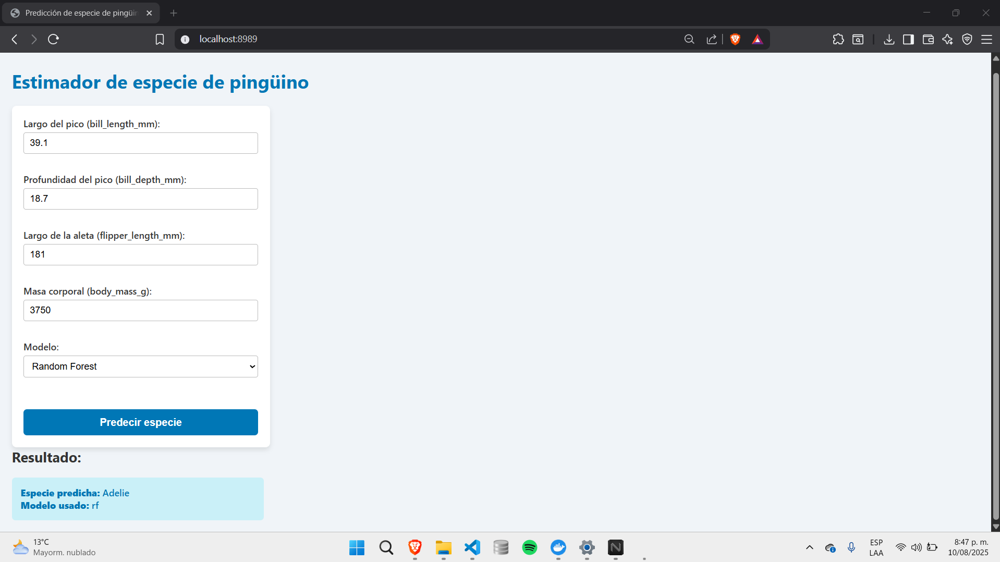
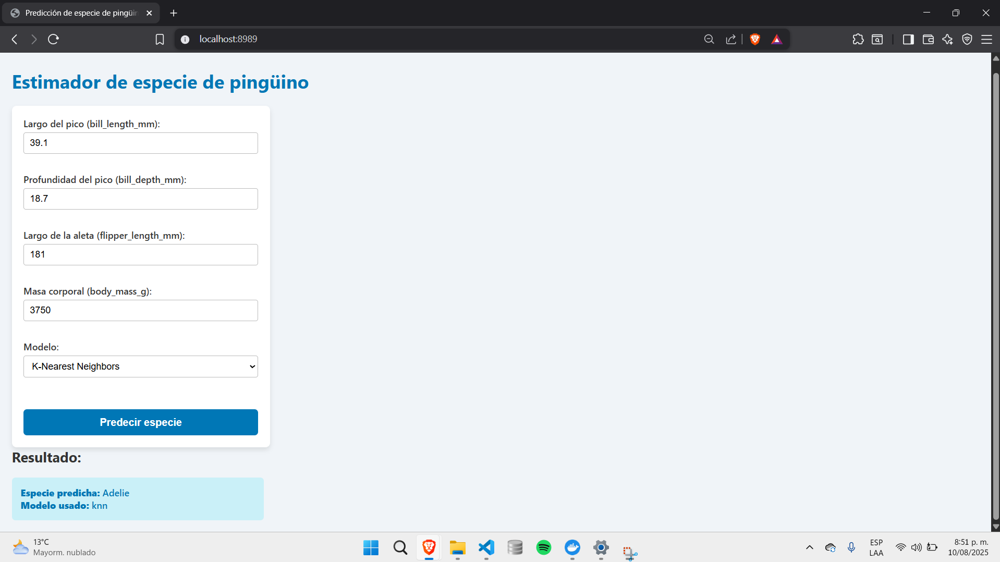

# Operaciones de aprendizaje automatico - TALLER 1
- Yibby Gonzalez
- Sebastian Ruiz
- Adrian Tellez

Este proyecto implementa un entorno basado en FastAPI y Docker para la creación, despliegue y consumo de un servicio de predicción de especies de pingüinos, utilizando el conjunto de datos palmerpenguins.

## Contenido del proyecto

- `train.py`: Entrena el modelo con `palmerpenguins` y guarda `models`
- `models`: Modelos entrenados
- `api.py`: API creada con FastAPI
- `index.html`: Interfaz grafica al usuario
- `Dockerfile`: Define la imagen de Docker
- `requirements.txt`: Librerías necesarias
- `README.md`: Documentación del proyecto


## 1. Creación y activación del entorno virtual

```bash
python -m venv OAP
OAP\Scripts\activate
```

## 2. Contrucción del modelo

### 2.1 Librerias

```txt
pip install -r requirements.txt
```

### 2.2 Entrenamiento de modelos

En el script `train.py` se preparo y se entreno los modelos para predecir la especie de pingüinos utilizando el dataset palmerpenguins. Primero se aseguro de que existiera una carpeta llamada models para almacenar los modelos entrenados. Luego se cargo los datos con la función load_penguins() y se realizo una limpieza eliminando las filas con valores faltantes. Se definio las variables de entrada a partir de las medidas físicas del pingüino, como la longitud y profundidad del pico, la longitud de la aleta y la masa corporal, mientras que la variable objetivo fue la especie, la cual se convirtio en valores numéricos usando LabelEncoder. Posteriormente se dividio los datos en un conjunto de entrenamiento y otro de prueba en una proporción 80/20, asegurando la reproducibilidad con random_state=42. Se entrenaron dos modelos distintos, un Random Forest Classifier y un K-Nearest Neighbors Classifier, para luego guardar cada uno en formato .pkl con la librería joblib. Finalmente, el script confirma que los modelos fueron entrenados y guardados correctamente dentro de la carpeta models.

## 3. Contrucción de API

En esta etapa se construyó la API utilizando FastAPI, con el propósito de servir un modelo de predicción de especies de pingüinos. Se montó la carpeta `static`, que contiene el archivo `index.html`, de manera que la ruta raíz (`/`) entrega la interfaz gráfica al usuario.

```python
from fastapi import FastAPI
from fastapi.responses import FileResponse
from fastapi.staticfiles import StaticFiles

app = FastAPI()

# Montar carpeta 'static' para archivos estáticos (donde va el index.html)
app.mount("/static", StaticFiles(directory="static"), name="static")

# Endpoint raíz para servir index.html
@app.get("/")
def read_index():
    return FileResponse("static/index.html")
```

Se cargaron de forma anticipada los modelos previamente entrenados —Random Forest y KNN— desde la carpeta models usando joblib, lo que permite evitar cargas repetidas en cada solicitud y optimizar el rendimiento.

```python
import joblib

# Cargar modelos al inicio
models = {
    "rf": joblib.load("models/rf_model.pkl"),
    "knn": joblib.load("models/knn_model.pkl")
}
```
Se definió un esquema de datos de entrada mediante Pydantic, asegurando que las solicitudes incluyan los valores de bill_length_mm, bill_depth_mm, flipper_length_mm y body_mass_g en formato numérico.

```python
from pydantic import BaseModel

# Esquema entrada
class PenguinInput(BaseModel):
    bill_length_mm: float
    bill_depth_mm: float
    flipper_length_mm: float
    body_mass_g: float
```
Se implementó el endpoint /predict, que recibe los datos y el nombre del modelo a utilizar (rf o knn). El sistema valida que el modelo esté disponible, transforma los datos de entrada a un arreglo de NumPy y ejecuta la predicción. Finalmente, se responde con el identificador numérico de la clase, el nombre de la especie correspondiente y el modelo utilizado para la predicción.

```python
from fastapi import HTTPException, Query
import numpy as np

# Diccionario para convertir predicciones a nombre especie
species_mapping = {
    0: "Adelie",
    1: "Chinstrap",
    2: "Gentoo"
}

# Endpoint predicción
@app.post("/predict")
def predict(data: PenguinInput, model_name: str = Query("rf", enum=["rf", "knn"])):
    if model_name not in models:
        raise HTTPException(status_code=400, detail="Modelo no disponible")
    model = models[model_name]
    features = np.array([[data.bill_length_mm, data.bill_depth_mm, data.flipper_length_mm, data.body_mass_g]])
    prediction = model.predict(features)[0]
    return {
        "prediction": int(prediction),
        "especie": species_mapping[int(prediction)],
        "modelo_usado": model_name
    }
```
Este enfoque garantiza una arquitectura modular y eficiente, y permite al usuario elegir el algoritmo con el que desea realizar la predicción.

## 3. Empaquetizar la API con Docker
Para facilitar el despliegue y asegurar que la API funcione de forma consistente en cualquier entorno, se realiza la Empaquetización usando Docker.
### 3.1 Creación de Dockerfile
Se Creo el archivo  Dockerfile que define cómo construir una imagen de Docker con todo lo necesario para ejecutar la API.

```docker
# Usamos una imagen oficial con Python
FROM python:3.10

# Carpeta donde trabajará Docker
WORKDIR /app

# Copiamos los archivos del proyecto al contenedor
COPY . .

# Instalamos dependencias
RUN pip install --no-cache-dir -r requirements.txt

# Exponemos el puerto 8989
EXPOSE 8989

# Comando para correr la API
CMD ["uvicorn", "api:app", "--host", "0.0.0.0", "--port", "8989"]
```

### 3.2 Contrucción de Imagen
Desde la carpeta raiz del proyecto se ejecuta:
```docker
docker build -t penguin-api .
```

### 3.3 Ejecutar contenedor
Para lanzar la API en un contenedor y mapear el puerto 8989 del contenedor al mismo puerto ejecutamos:

```docker
docker run -p 8989:8989 penguin-api
```

## Anexos

### Interfaz grafica del modelo

### Uso del modelo Random Forest
Para los datos proporcionados,correspondientes a un pingüino con longitud de pico 39.1 mm, profundidad de pico 18.7 mm, longitud de aleta 181 mm y peso corporal 3750 gramos, se probó el modelo Random Forest. El modelo arrojó satisfactoriamente que la especie es Adelie.

### Uso del modelo K-Nearest Neighbors
Para los datos proporcionados, correspondientes a un pingüino con longitud de pico 39.1 mm, profundidad de pico 18.7 mm, longitud de aleta 181 mm y peso corporal 3750 gramos, se probó el modelo K-Nearest Neighbors. El modelo arrojó satisfactoriamente que la especie es Adelie.
